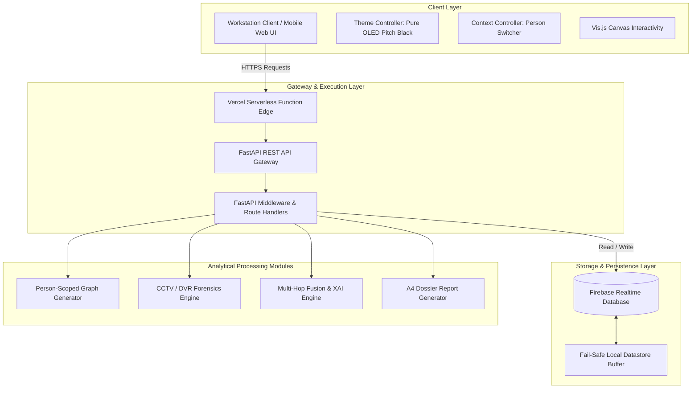

# 🏗️ TRACE FINDERS — SYSTEM ARCHITECTURE DOCUMENT

**System Version:** `10.0.0`  
**Target Specification:** SIH 2026 — Problem Statement `SIH26189` (AI-Powered Criminal Network Analysis System)  
**Security Level:** Law Enforcement & Forensic Analyst Operational Specification  

---

## 📑 System Architecture Table of Contents

1. [Executive Summary & Architectural Philosophy](#1-executive-summary--architectural-philosophy)
2. [End-to-End System Topology](#2-end-to-end-system-topology)
3. [Person-Scoped Data Isolation Architecture](#3-person-scoped-data-isolation-architecture)
4. [Link Analysis Knowledge Graph Engine](#4-link-analysis-knowledge-graph-engine)
5. [CCTV / DVR Forensics & Timeline Pipeline](#5-cctv--dvr-forensics--timeline-pipeline)
6. [Multi-Hop Cross-Domain Evidence Fusion & XAI Engine](#6-multi-hop-cross-domain-evidence-fusion--xai-engine)
7. [Cloud Infrastructure & Deployment Topology](#7-cloud-infrastructure--deployment-topology)
8. [Security, Integrity & SHA-256 Chain of Custody](#8-security-integrity--sha-256-chain-of-custody)

---

## 1. Executive Summary & Architectural Philosophy

**TRACE FINDERS** is designed around three architectural pillars:

```
┌─────────────────────────────────────────────────────────────────────────┐
│                          TRACE FINDERS PILLARS                          │
├──────────────────────────┬──────────────────────┬───────────────────────┤
│   STRICT PERSON SCOPING  │  MULTI-HOP FUSION    │   EXPLAINABLE AI      │
│  Zero context bleeding   │  Cross-domain links  │  Human-understandable │
│  across target profiles  │  CDR ➔ ANPR ➔ Wallet │  correlation rationale│
└──────────────────────────┴──────────────────────┴───────────────────────┘
```

1. **Strict Context Separation**: The data layer enforces complete isolation between subject profiles (`P-001` through `P-006`). No shared global references bleed across active target workstations.
2. **Multi-Hop Evidence Fusion**: Evidence records across telecom CDRs, banking ledgers, ANPR CCTV captures, and blockchain transactions are joined via graph walks.
3. **Explainable AI (XAI)**: Machine-generated recommendations provide transparent reasoning, confidence metrics, and alternative hypothesis flags to satisfy court evidentiary standards.

---

## 2. End-to-End System Topology



---

## 3. Person-Scoped Data Isolation Architecture

To prevent context leakage, every entity is stored under a primary key index tied to a specific `person_id`.

```
datastore/
  ├── profiles/
  │     ├── P-001/  (Arjun Sharma - Primary Subject)
  │     ├── P-002/  (Rohan Mehta - Business Contact)
  │     ├── P-003/  (Priya Joshi - Associate)
  │     ├── P-004/  (Vikram Patil - Person of Interest)
  │     ├── P-005/  (Neha Kulkarni - Employee)
  │     └── P-006/  (Arjun S. - Ambiguous Match Candidate)
  ├── cases/
  │     └── TRX-2026-017/ (Operation Nexus)
  ├── cctv_inventory/ (CAM-01 through CAM-12)
  ├── multi_hop_chains/
  └── audit_logs/
```

### Profile Data Model Schema
```typescript
interface PersonProfile {
  id: string;                // e.g. 'P-001'
  name: string;              // e.g. 'Arjun Sharma'
  alias: string;             // e.g. 'Arjun S.'
  role: string;              // e.g. 'Primary Subject'
  age: number;
  gender: string;
  phone: string;             // Isolated 10-digit primary MSISDN
  email: string;             // Isolated primary email
  vehicle: string;           // Isolated registration number (ANPR tag)
  account_number: string;    // Isolated bank ledger identifier
  wallet_address: string;    // Isolated EVM/UTXO blockchain wallet
  photo_url: string;         // Embedded portrait URI
  status: string;            // 'Under Investigation' | 'Verified'
  counts: {
    calls: number;
    messages: number;
    financial: number;
    blockchain: number;
    cctv: number;
    osint: number;
  };
}
```

---

## 4. Link Analysis Knowledge Graph Engine

The Link Analysis engine uses the **Vis.js Network Library** embedded into an unconstrained canvas container.

```
┌─────────────────────────────────────────────────────────────────┐
│               VIS.JS LINK ANALYSIS GRAPH ENGINE                 │
├─────────────────────────────────────────────────────────────────┤
│                                                                 │
│                 [ PHONE: +91 98765 1201 ]                       │
│                           │ (Used By)                           │
│                           ▼                                     │
│   [ ROHAN MEHTA ] ◄─── (TARGET: ARJUN SHARMA) ───► [ VEHICLE ] │
│   (Business)                  │ (Transacts)       (MH12 AB 4821)│
│                               ▼                                 │
│                     [ BANK: XXXX4821 ]                          │
│                                                                 │
└─────────────────────────────────────────────────────────────────┘
```

### Layout Algorithms
1. **Tree (Root Top)**: Enforces directed hierarchical level separation (`UD`). The currently selected target subject (`person_id`) is positioned dynamically as Level 0 root node.
2. **Radial**: Generates concentric topological distance rings radiating outward from the root subject node.
3. **Hierarchy**: Left-to-right (`LR`) chronological dependency tree.
4. **Compact**: Barnes-Hut gravitational force-directed clustering model ($\text{gravity} = -1000$, $\text{spring} = 50$).

---

## 5. CCTV / DVR Forensics & Timeline Pipeline

The CCTV module manages **12 active camera feeds** (`CAM-01` to `CAM-12`) without carousel truncation.

```
┌─────────────────────────────────────────────────────────────────┐
│                  CCTV / DVR FORENSICS PIPELINE                  │
├─────────────────────────────────────────────────────────────────┤
│  CAMERA REGISTRY ──► EVENT MARKER INDEX ──► CLIP SELECTION      │
│  (12 Cams Grid)      (00:00 - 23:59 IST)    (ANPR & Face Rec)   │
└─────────────────────────────────────────────────────────────────┘
```

### Camera Metadata Model
```json
{
  "id": "CAM-04",
  "name": "Pune Central Zone",
  "location": "Shivajinagar, Pune",
  "camera_type": "Fixed CCTV",
  "status": "Active Recording",
  "resolution": "1920 x 1080",
  "recording_window": "00:00 - 23:59",
  "events_count": 12,
  "evidence_links": 8,
  "associated_persons_count": 3
}
```

---

## 6. Multi-Hop Cross-Domain Evidence Fusion & XAI Engine

The Fusion engine computes multi-hop evidence correlation paths across disparate data domains:

$$\text{Hop}_1 (\text{Profile}) \longrightarrow \text{Hop}_2 (\text{Telecom CDR}) \longrightarrow \text{Hop}_3 (\text{DVR ANPR}) \longrightarrow \text{Hop}_4 (\text{Wire Ledger}) \longrightarrow \text{Hop}_5 (\text{Blockchain})$$

```typescript
interface FusionChainStep {
  step: number;
  domain: 'PROFILE' | 'TELECOM' | 'CCTV' | 'FINANCIAL' | 'BLOCKCHAIN';
  label: string;
  detail: string;
  badge: string;
}

interface XAIEssessment {
  title: string;
  confidence_score: string;  // e.g. "88%"
  action_status: string;     // e.g. "VERIFIED CORRELATION"
  what: string;              // Correlation rationale
  why: string;               // Flagging rationale
  alternative_explanation: string; // Counter-hypothesis for legal review
  supporting_evidence: string[];   // SHA-256 evidence record refs
}
```

---

## 7. Cloud Infrastructure & Deployment Topology

The application is deployed across a serverless hybrid cloud topology:

```
                       ┌────────────────────────┐
                       │   GitHub Repository    │
                       │ (tracefinders/main)    │
                       └───────────┬────────────┘
                                   │ Git Push / Webhook
                                   ▼
                       ┌────────────────────────┐
                       │ Vercel Serverless Edge │
                       │ (Python 3.12 Engine)   │
                       └───────────┬────────────┘
                                   │ HTTPS REST Sync
                                   ▼
                       ┌────────────────────────┐
                       │ Firebase Realtime DB   │
                       │ (tracefinders-daa12)   │
                       └────────────────────────┘
```

---

## 8. Security, Integrity & SHA-256 Chain of Custody

All evidence assets and investigative actions undergo SHA-256 cryptographic hashing prior to rendering.

```json
{
  "evidence_id": "EV-COM-001",
  "case_id": "TRX-2026-017",
  "personId": "P-001",
  "acquisition_date": "18 Aug 2026 10:18 IST",
  "sha256_hash": "e3b0c44298fc1c149afbf4c8996fb92427ae41e4649b934ca495991b7852b855",
  "custody_status": "Verified - Legal Admissible"
}
```

---
*TRACE FINDERS Architectural Specification Document. Smart India Hackathon (SIH 2026).*
