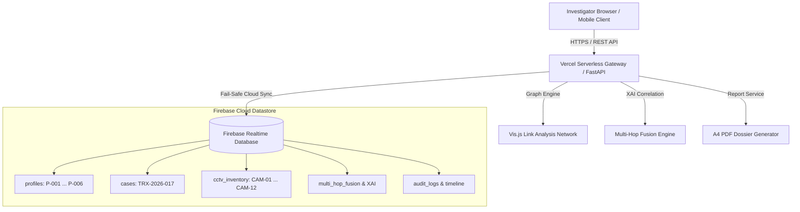

<div align="center">

  

  # 🔍 TRACE FINDERS
  ### AI-Powered Criminal Network Intelligence & Evidence Fusion Workstation

  [](https://sih.gov.in)
  [](https://fastapi.tiangolo.com)
  [](https://firebase.google.com)
  [](https://vercel.com)
  [](https://python.org)
  [](LICENSE)

  <p align="center">
    <b>Next-Generation Enterprise Intelligence Platform for Law Enforcement, Forensic Analysts, and Cyber Crime Investigation Units.</b>
  </p>

  <p align="center">
    <a href="https://criminalnetworkanalysis.vercel.app"><b>🌐 Live Cloud Workstation</b></a> •
    <a href="https://github.com/nikhil24x5183-netizen/tracefinders"><b>📦 GitHub Repository</b></a> •
    <a href="ARCHITECTURE.md"><b>🏗️ System Architecture</b></a>
  </p>

</div>

---

## 📑 Table of Contents

- [🌟 System Overview](#-system-overview)
- [⚡ Key Intelligence Capabilities](#-key-intelligence-capabilities)
- [🏗️ High-Level Architecture](#️-high-level-architecture)
- [📱 Responsive UI & Workstation Themes](#-responsive-ui--workstation-themes)
- [📊 Data Model & Person-Scoped Isolation](#-data-model--person-scoped-isolation)
- [🛠️ Tech Stack](#️-tech-stack)
- [🚀 Quick Start & Installation](#-quick-start--installation)
- [🔧 Firebase Cloud Database Setup](#-firebase-cloud-database-setup)
- [🌐 Live Deployment Links](#-live-deployment-links)
- [📜 License & Acknowledgments](#-license--acknowledgments)

---

## 🌟 System Overview

**TRACE FINDERS** is a state-of-the-art criminal network analysis workstation engineered for law enforcement agencies, cybercrime investigation cells, and forensic intelligence teams under **Smart India Hackathon (SIH 2026 - Problem Statement SIH26189)**.

Traditional investigative tools suffer from context bleeding, static visualizations, and fragmented evidence data across isolated silos (CDR logs, bank wire ledgers, CCTV DVR streams, blockchain wallets, and social media OSINT). **TRACE FINDERS** resolves this by establishing a **100% Person-Scoped Investigation Data Engine**, correlated through **Multi-Hop Cross-Domain Evidence Fusion** and **Explainable AI (XAI)** decision support.

---

## ⚡ Key Intelligence Capabilities

### 👤 1. 100% Person-Scoped Data Model & Dynamic Switching
- **Zero Context Bleeding**: Every primary suspect, associate, and person of interest maintains a strictly isolated investigative record tree.
- **Dynamic Context Controller**: Switching the active target subject instantly transforms all workstation panels, financial ledgers, communication trees, DVR video clips, timeline chronology, and graph networks.
- **6 Distinct Target Profiles Built-In**:
  - `P-001` **Arjun Sharma** — Primary Subject *(Logistics & Financial Controller)*
  - `P-002` **Rohan Mehta** — Business Contact *(Cross-Border Importer)*
  - `P-003` **Priya Joshi** — Associate *(Corporate Accounts Executive)*
  - `P-004` **Vikram Patil** — Person of Interest *(Hawala Transactor)*
  - `P-005` **Neha Kulkarni** — Employee *(Internal Transport Dispatcher)*
  - `P-006` **Arjun S.** — Ambiguous Match Candidate *(Entity Resolution Pipeline)*

### 🕸️ 2. Interactive Vis.js Link Analysis Knowledge Graph
- **360° Drag & Pan Control**: Fully interactive graph canvas supporting pinch zoom, unconstrained dragging, free node repositioning, and double-click target focus.
- **4 Algorithmic Layout Engines**:
  - `Tree (Root Top)` — Directed hierarchical top-down flow centered on the active target subject.
  - `Radial` — Concentric multi-hop degree rings.
  - `Hierarchy` — Left-to-right temporal/role dependency layout.
  - `Compact` — High-density force-directed cluster layout.
- **Floating Controls Overlay**: Quick-action floating toolbar (`[ + ]` Zoom In, `[ − ]` Zoom Out, `[ ⛶ ]` Fit to Screen, `[ ⟳ ]` Reset Layout, `[ 🎯 ]` Re-Center Root Node).

### 📹 3. CCTV / DVR Forensics Workspace
- **All-Camera Responsive Inventory Grid**: Displays all 12 monitored camera locations (`CAM-01` through `CAM-12`) simultaneously with zero clipped cards or hidden carousels.
- **24-Hour Recording Event Timeline**: Visual marker timeline (00:00 to 23:59 IST) displaying exact timestamps of suspect sightings, vehicle ANPR triggers, and meeting events.
- **3-Column Split Analytics Layout**:
  - **Left Column**: Chronological Evidence Timeline.
  - **Center Column**: Multi-Camera Video Clip Player with playback controls (`▶`, `⏮ 10s`, `⏭ 10s`) & SHA-256 evidence reference tags.
  - **Right Column**: Cross-domain Related Entities & Camera Registry.

### 🔗 4. Multi-Hop Evidence Fusion & Explainable AI (XAI)
- **Cross-Domain Correlation Pipeline**: Automatically links entity nodes across 5 analytical domains:
  $$\text{Person Profile} \xrightarrow{\text{CDR}} \text{Telecom Node} \xrightarrow{\text{ANPR}} \text{CCTV Event} \xrightarrow{\text{Wire}} \text{Financial Ledger} \xrightarrow{\text{Wallet}} \text{Blockchain}$$
- **XAI Assessment Engine**: Generates human-understandable correlation rationale, confidence scores, flagging triggers, and alternative hypotheses to support judicial review.

### 📄 5. Official Investigation Dossier & A4 PDF Generator
- **Embedded Profile Photo**: Profile card displaying target portrait, aliases, identifier grid, and legal risk classification.
- **Native Print & PDF Export**: Instant A4-formatted PDF generation using `@page { size: A4; margin: 15mm; }` via browser print engine integration.

---

## 🏗️ High-Level Architecture



---

## 📱 Responsive UI & Workstation Themes

- **Pure OLED Pitch Black & Obsidian Theme**: Engineered with `#000000` pitch black background, `#090a0f` matte charcoal cards, `#040406` obsidian headers, and `#38bdf8` electric cyan accents for low eye strain during overnight operations.
- **Mobile & Tablet Drawer Navigation**: On screens $\le 768\text{px}$, the sidebar smoothly transforms into a slide-out drawer (`z-index: 2000`) with touch-optimized scroll wrappers for all data tables.

---

## 📊 Data Model & Person-Scoped Isolation

```json
{
  "datastore": {
    "profiles": {
      "P-001": {
        "id": "P-001",
        "name": "Arjun Sharma",
        "role": "Primary Subject",
        "phone": "+91 98765 1201",
        "email": "arjun.sharma.demo@example.test",
        "vehicle": "MH12 AB 4821",
        "account_number": "XXXX4821",
        "wallet_address": "0xDEMO...A721"
      },
      "P-002": {
        "id": "P-002",
        "name": "Rohan Mehta",
        "role": "Business Contact",
        "phone": "+91 97765 4876",
        "email": "rohan.mehta.demo@example.test",
        "vehicle": "MH01 CR 7814",
        "account_number": "XXXX7312",
        "wallet_address": "0xDEMO...D492"
      }
    }
  }
}
```

---

## 🛠️ Tech Stack

| Layer | Technology / Library |
| :--- | :--- |
| **Frontend UI** | HTML5, CSS3 Variables, ES6 JavaScript, Vis.js Network Engine |
| **Backend REST API** | Python 3.12, FastAPI, Uvicorn |
| **Cloud Database** | Firebase Realtime Database & Firestore REST Service |
| **Serverless Deployment** | Vercel Serverless Functions (`@vercel/python`) |
| **Source Control** | Git, GitHub Actions / CI |

---

## 🚀 Quick Start & Installation

### 1. Clone the Repository
```bash
git clone https://github.com/nikhil24x5183-netizen/tracefinders.git
cd tracefinders
```

### 2. Install Dependencies
```bash
pip install -r requirements.txt
```

### 3. Run Local Development Server
```bash
python -m uvicorn backend.app:app --host 0.0.0.0 --port 8000
```
Open **`http://localhost:8000`** in your browser.

---

## 🔧 Firebase Cloud Database Setup

To link your personal Firebase Console project:
1. Open **[https://console.firebase.google.com](https://console.firebase.google.com)**.
2. Select your project (e.g. `tracefinders-daa12`).
3. Click **Build ➔ Realtime Database ➔ Create Database** (Start in **Test Mode**).
4. Set environment variable on Vercel or locally:
   ```bash
   export FIREBASE_DATABASE_URL="https://your-project-id-default-rtdb.firebaseio.com"
   ```

---

## 🌐 Live Deployment Links

- **🌐 Vercel Live Production App**: **[https://criminalnetworkanalysis.vercel.app](https://criminalnetworkanalysis.vercel.app)**
- **📦 GitHub Repository**: **[https://github.com/nikhil24x5183-netizen/tracefinders](https://github.com/nikhil24x5183-netizen/tracefinders)**
- **🔥 Firebase JSON Feed**: **[https://tracefinders-daa12-default-rtdb.firebaseio.com/datastore.json](https://tracefinders-daa12-default-rtdb.firebaseio.com/datastore.json)**
- **🏗️ Architecture Documentation**: **[ARCHITECTURE.md](ARCHITECTURE.md)**

---

## 📜 License & Acknowledgments

Distributed under the **MIT License**. Developed for **Smart India Hackathon 2026 (Problem SIH26189)**.
